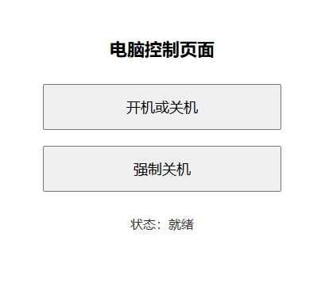
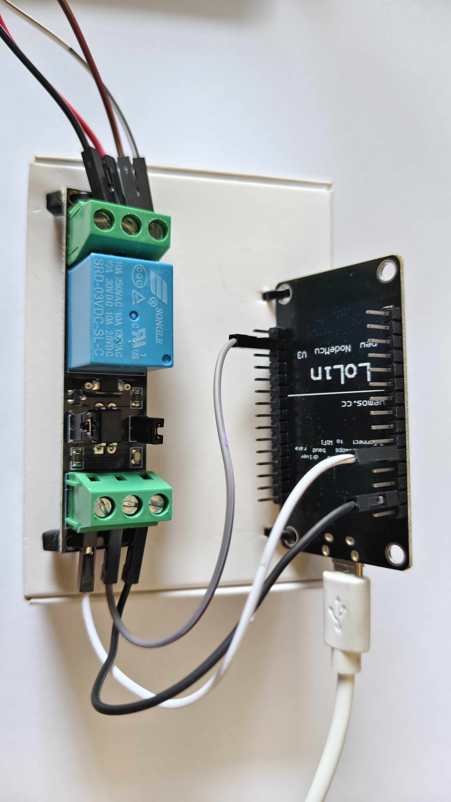
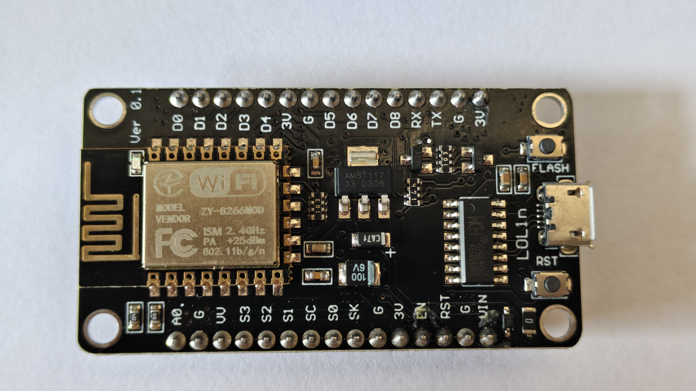
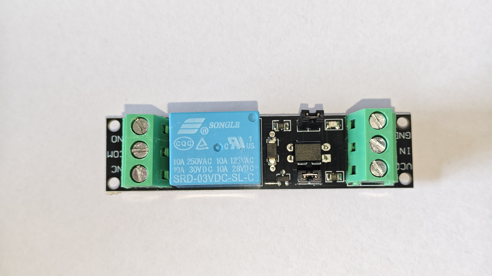
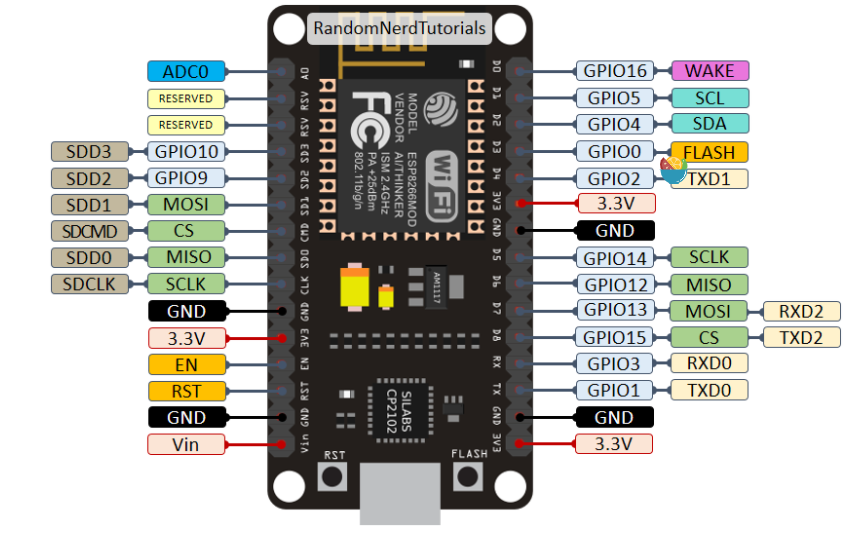
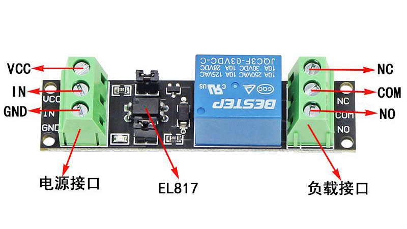
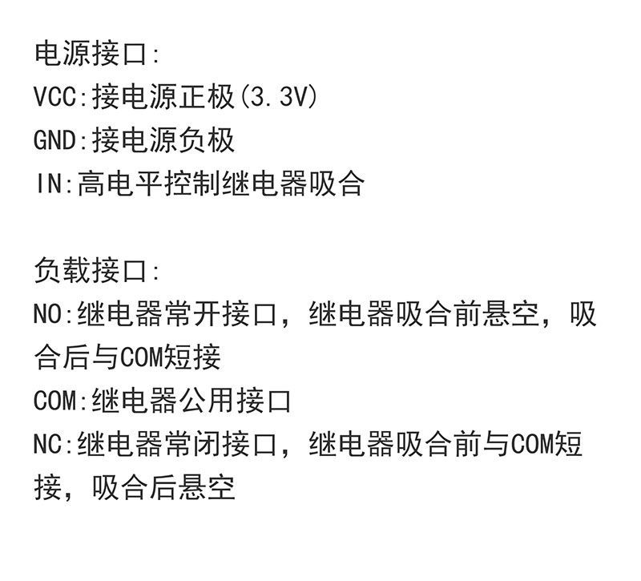
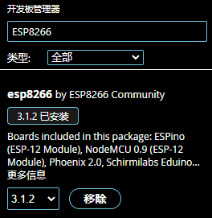
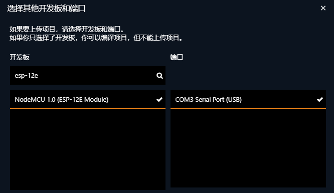

<div align="center">
  <h1> ESP8266-PC_PowerSwitch </h1>
  
  
  
  
  
  
  <h3>基于 ESP8266 的简单电脑电源远程控制项目</h3>
  
  
</div>

## 💡 功能特点
- 远程开机：通过网页按钮远程开机
- 强制关机：模拟长按电源按钮 5 秒，强制关闭电脑
- Wi-Fi 控制：无需额外的软件，只需确保设备处于同一局域网
- 网页界面：简单直观，支持手机、电脑等多种设备

## 🛠️ 硬件需求

| ESP8266 12-E 开发板 | `3.3V` 继电器模块(高电平) |
| --- | --- |
|  |  |

<details>
  <summary> ESP8266 12-E 引脚资料 </summary>
  
</details>

<details>
  <summary> 继电器光耦隔离资料 </summary>
  
  
</details>

## 🔌 接线方式

### ESP8266 <---> 继电器

| ESP8266    | 继电器 |
| ---------- | --- |
| D1 (GPIO5) | IN  |
| GND        | GND |
| 3.3V       | VCC |

### 继电器 <---> PC主板
| 继电器  |  PC主板   |
| ------ | --------- |
|  COM   | PowerSW 1 |
|  NO    | PowerSW 2 |

> 继电器相当于模拟按下电脑开机键：
>
> - 短接约 1 秒 → 开机/正常关机
> - 短接约 5 秒 → 强制关机

## 📦 软件环境

### USB转串口驱动
- CH340
```text
https://www.wch.cn/downloads/CH341SER.EXE.html
```

### Arduino IDE

- 配置其他开发板管理器地址：

```text
https://arduino.esp8266.com/stable/package_esp8266com_index.json
```

- 在 `开发板管理器` 搜索并安装 `ESP8266` 开发板



## ⚙️ 配置说明

打开项目：

```
ESP8266-PC_PowerSwitch.ino
```
- 通过USB数据线将开发板与电脑连接
- 选择开发板，搜索`esp-12e`



修改 Wi-Fi 配置：

```cpp
const char* ssid = "wifi名称";
const char* password = "wifi密码";
```

修改静态 IP：

```cpp
IPAddress local_IP(192, 168, 1, 150);  // 设定ESP8266的IP地址
IPAddress gateway(192, 168, 1, 1);  // 设定默认网关
IPAddress subnet(255, 255, 255, 0);  // 设定子网掩码
IPAddress primaryDNS(192, 168, 1, 1);  // 设定首选DNS服务器
```

- 修改保存完毕，编译上传。即可通过设定的IP地址访问网页控制

## ⚠️ 注意事项

1. 本项目默认运行在 **局域网环境** ,请避免使用不安全的公共 Wi-Fi 网络。

2. 如果需要公网访问，请自行配置：

    * VPN
    * 内网穿透
    * 路由器端口映射

## ⚖️ 许可证

本项目采用 MIT 许可证 - 详情请参阅 [LICENSE](LICENSE) 文件